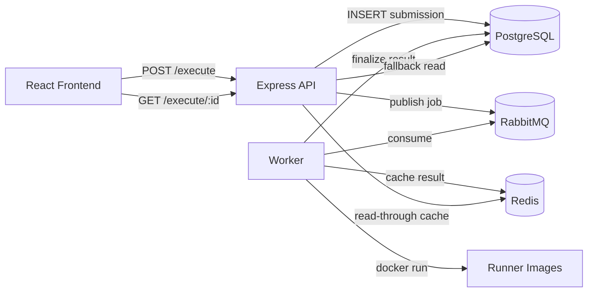

# CodeForge

CodeForge is a distributed code execution platform with an async execution pipeline, secure Docker-based language runners, queue-driven workers, result caching, retry recovery, and a one-page IDE frontend.

## Highlights

- Async-first architecture: API responds quickly after queueing jobs.
- Multi-language execution: Python 3, Node.js 20, Java 17, C++20.
- Isolated execution with Docker limits (network off, memory/pids/cpu constraints).
- Redis-backed fast polling results.
- RabbitMQ-based job dispatch and retry flow.
- PostgreSQL durability for submissions and final results.
- Reliability services: DLQ retry processor, worker heartbeat monitor, autoscaler.
- Interactive frontend IDE with resizable panels and live status polling.

## Monorepo Structure

```text
CodeForge/
	backend/    # API, workers, queue processing, Docker execution engine
	frontend/   # React IDE client
```

## System Architecture

1. Frontend sends `POST /execute`.
2. API validates payload, stores submission, publishes job to RabbitMQ.
3. Worker consumes job and executes code in language-specific runner container.
4. Worker writes result to Redis cache and PostgreSQL.
5. Frontend polls `GET /execute/:submissionId` until final status.

### High-level architecture



### Request flow
1. Frontend sends `POST /execute`.
2. API validates request and inserts `PENDING` submission.
3. API publishes execution job to RabbitMQ and updates submission to `QUEUED`.
4. Worker consumes message, marks `RUNNING`, executes in Docker, computes verdict.
5. Worker caches result in Redis and writes final state to PostgreSQL.
6. Frontend polls `GET /execute/:submissionId` until terminal status.

### Data flow
- Durable canonical record: PostgreSQL `submissions`
- Hot read path: Redis hash `exec:result:{submissionId}`
- Transport: RabbitMQ queue `execution.queue`

---

Core runtime components:

- API server (Express)
- Worker process(es)
- PostgreSQL
- Redis
- RabbitMQ
- Runner images: `codeforge/runner-python3:latest`, `codeforge/runner-nodejs20:latest`, `codeforge/runner-java17:latest`, `codeforge/runner-cpp20:latest`

## Tech Stack

- Backend: Node.js, Express, PostgreSQL, RabbitMQ, Redis
- Execution isolation: Docker
- Frontend: React (react-scripts)

## Local Setup

### Prerequisites

- Node.js 18+
- Docker Desktop
- PostgreSQL, Redis, RabbitMQ (local or containers)

### 1) Configure Backend Environment

In `backend`, copy `.env.example` to `.env` and update values for your machine.

### 2) Install Dependencies

```bash
cd backend
npm install

cd ../frontend
npm install
```

### 3) Run Backend (single command)

```bash
cd backend
npm run start:all
```

`start:all` performs:

1. `db:init`
2. `db:migrate`
3. `runners:build`
4. Starts API + worker + retry processor + health monitor + autoscaler

### 4) Run Frontend

Recommended: run frontend on `3001` and backend on `3000`.

Windows PowerShell:

```powershell
cd frontend
$env:PORT=3001; npm start
```

## Backend Scripts

From `backend` directory:

- `npm start` -> API server
- `npm run start:worker` -> execution worker
- `npm run start:core` -> API + worker
- `npm run start:services` -> API + worker + retry + health + autoscaler
- `npm run setup:all` -> init DB + migrate + build runner images
- `npm run start:all` -> setup + all long-running services
- `npm run runners:build` -> build runner images
- `npm run runners:clean` -> remove runner images
- `npm run db:init` -> apply base schema
- `npm run db:migrate` -> apply resilience schema changes
- `npm run retry:processor` -> DLQ retry processor
- `npm run worker:health-monitor` -> stuck worker detection
- `npm run worker:autoscaler` -> dynamic worker scaling
- `npm run smoke:test` -> backend smoke test

## API Reference

### Submit Code

`POST /execute`

Request body:

```json
{
	"language": "python3",
	"code": "print('hello')",
	"stdin": "",
	"expected_output": "hello",
	"timeout_sec": 10
}
```

Response:

```json
{
	"submission_id": "uuid",
	"status": "QUEUED",
	"poll_url": "/execute/uuid"
}
```

### Poll Result

`GET /execute/:submissionId`

Returns in-progress or final status, output, runtime, exit code, and source (`redis` or `postgres`).

### Health Check

`GET /health`

## Supported Status Values

- PENDING
- QUEUED
- RUNNING
- ACCEPTED
- WRONG_ANSWER
- TIME_LIMIT
- MEMORY_LIMIT
- RUNTIME_ERROR
- SYSTEM_ERROR

## Security and Isolation Defaults

- `--network none`
- `--read-only`
- Memory/CPU/PID limits
- tmpfs mounts for execution
- Timeout-enforced command execution

## Production Notes

This project uses Docker-based code execution from worker processes. Ensure your production host allows Docker usage by worker services.

Practical deployment model:

1. Frontend on static hosting (for example Cloudflare Pages).
2. Backend stack on Docker-capable VM (API + worker + Postgres + Redis + RabbitMQ).
3. Run backend services as always-on processes (compose/systemd/PM2).

## Troubleshooting

- CORS errors: verify `FRONTEND_URL` in `backend/.env`.
- 400 on submit: verify request payload and `expected_output` type.
- Execution failures: confirm runner images exist and Docker is running.
- Stuck jobs: check `worker:health-monitor` logs.
- Missing retries: check `retry:processor` logs.

## License

MIT
